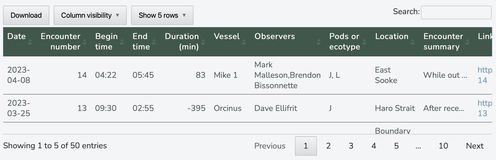
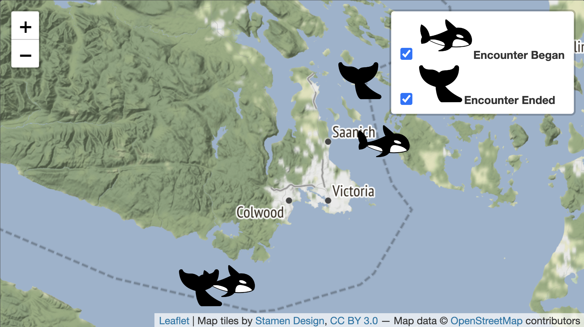

<!-- README.md is generated from README.Rmd. Please edit that file -->

```{r, include = FALSE}
knitr::opts_chunk$set(
  collapse = TRUE,
  comment = "#>",
  fig.path = "man/figures/README-",
  out.width = "100%"
)
```

# orcas

<!-- badges: start -->

[](https://github.com/jadeynryan/orcas/actions/workflows/R-CMD-check.yaml) [](https://app.codecov.io/gh/jadeynryan/orcas?branch=master)

<!-- badges: end -->

The goal of `orcas` is to scrape orca sighting data from the web and visualize it in maps and tables.

[R Ladies Seattle](https://rladiesseattle.org "R Ladies Seattle URL") invited me to give a talk for the 'R in the Outdoors' [meetup](https://www.meetup.com/rladies-seattle/ "meetup URL"). This was my first in-person talk of my professional career! I used this as an opportunity to learn new skills through a personal project. I've always had an affinity for the Southern Resident Killer Whales in the Salish Sea. The [Center for Whale Research](https://www.whaleresearch.com "Center for Whale Research URL") does a lot of really fascinating and important work monitoring their population. They post their survey data on their website; each encounter with the orcas is a separate webpage. Lately, I've been curious and intimidated by web scraping so I decided this would make a great case study and personal project.

`orcas` is still a work in progress, as the `cwr_tidy` dataset is mostly tidy but not completely clean. There are still missing values and typos, as evident from some encounters having a negative duration.

> All photos and data belong to the Center for Whale Research, a 501c3 nonprofit organization registered in Washington State.

## Installation

You can install the development version of `orcas` from [GitHub](https://github.com/ "GitHub URL") with:

``` r
# install.packages("devtools")
devtools::install_github("jadeynryan/orcas")
```

## R in the Outdoors Presentation

While there is no recording of the talk, you can view the [slides](https://rpubs.com/jadeynryan/orcas_RLadiesSeattleTalk "slides URL").

[](https://rpubs.com/jadeynryan/orcas_RLadiesSeattleTalk)

## Examples

**Scrape the two most recent encounters from 2022 and 2023:**

```{r}
orcas::make_encounter_df(years = 2022:2023, max_urls = 2)
```

**Make an interactive DT of 2023 encounters:**

```{r, eval=FALSE}
orcas::cwr_tidy |> 
  subset(year == 2023) |> 
  orcas::make_dt()
```



**Make an interactive leaflet map of last two 2023 encounters:**

```{r, eval=FALSE}
orcas::cwr_tidy |> 
  subset(year == 2023) |> 
  head(2) |> 
  orcas::make_leaflet()
```


